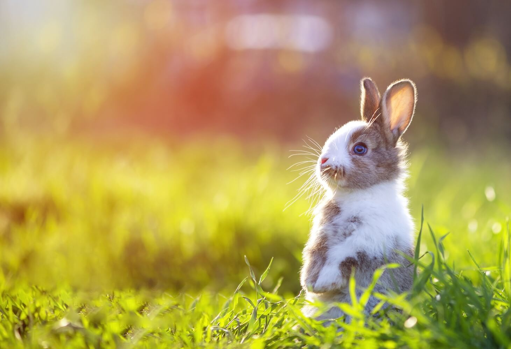

# The story of the little rabbit

This is the story of the little rabbit :
Once upon a time... in a **far far away** forest, lived a rabbit.
He had a lot of friends like :
* Owls
* Deers
* Hedgehogs
* Birds
* Other rabbits

Everyday he went to the market in [London](https://fr.wikipedia.org/wiki/Londres).
But one day, everything went wrong...

What a surprise when he met **Johnny Cadillac** ordering the last of the carrot of the market

Without any hesitation, the hungry little rabbit **jumped** on Johnny, **grabbed** the carrot Mr Cadillac had just bought, and ate it in one bite. The other clients could only see a food induced madness in the eyes of our little rabbit, until he finished swallowing the delicious looking carrot. Back to normal, the little rabbit wondered why Johnny Cadillac was on the ground, and ,more importantly, *why he was on top of him*.

The rabbit had just realized the horror he had committed.

The whole store was looking at him in **horror.**

What could he do?Leave the store quickly before the police arrived? Apologize? The rabbit was **confused.**..The rabbit had just realized the horror he had committed.

